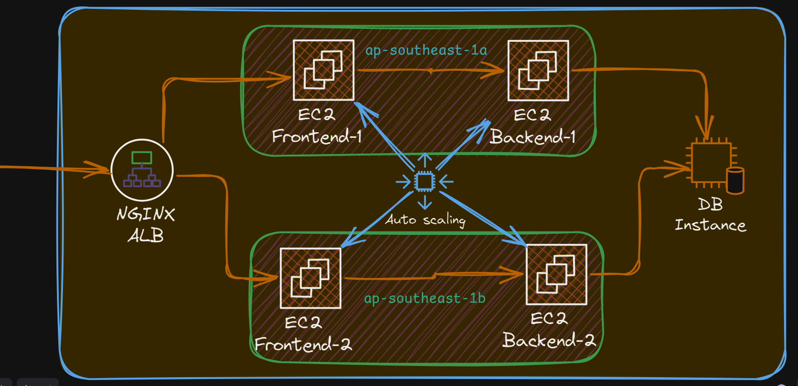
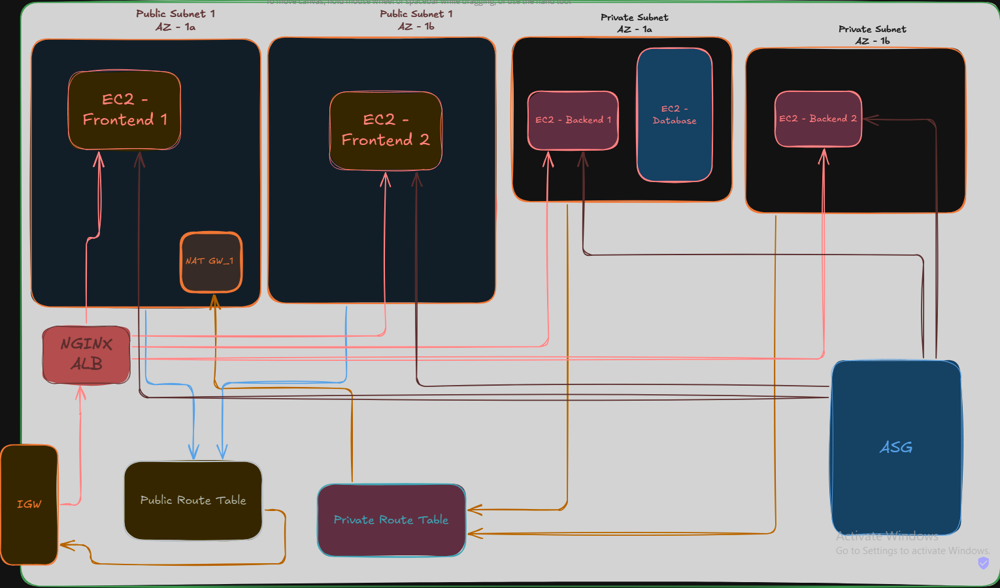

# Todo Application Project

## Overview

This project is a full-stack Todo application with a React frontend, FastAPI backend, and infrastructure managed with Pulumi. The application is containerized using Docker and can be deployed on AWS EC2 instances.

## System HLD



## Project Structure

1. Navigate to the `backend` directory
2. Create a virtual environment and activate it
3. Install dependencies:
```
.
├── backend/
│   ├── Dockerfile
│   ├── init.py
│   ├── database.py
│   ├── main.py
│   ├── models.py
│   └── requirements.txt
├── infra/
│   ├── Docker/
│   │   ├── docker-compose-be.yml
│   │   ├── docker-compose-db.yml
│   │   ├── docker-compose-fe.yml
│   │   └── docker-compose-lb.yml
│   ├── Scripts/
│   │   └── user_data.sh
│   ├── nginx/
│   │   └── nginx_lb.conf
│   ├── Pulumi.dev.yaml
│   ├── Pulumi.yaml
│   ├── main.py
│   ├── ec2.py
│   ├── pyproject.toml
│   ├── security_groups.py
│   ├── vpc.py
│   └── ...
└── todo-frontend/
    ├── package.json
    ├── README.md
    └── ...
```
## Components

1. **Frontend (todo-frontend)**
   - React-based frontend application
   - Uses Vite as the build tool
   - Incorporates various UI libraries including MUI and Radix UI

2. **Backend (backend)**
   - FastAPI-based backend application
   - Handles API requests and database operations

3. **Infrastructure (infra)**
   - Pulumi scripts for managing AWS infrastructure
   - Docker Compose files for containerization
   - Nginx configuration for load balancing

## Setup and Installation

### Prerequisites

- Node.js and npm (for frontend)
- Python 3.10 or higher (for backend and infrastructure)
- Docker and Docker Compose
- AWS CLI configured with appropriate credentials
- Pulumi CLI

### Frontend Setup

1. Navigate to the `todo-frontend` directory
2. Install dependencies:
```
   npm install
```
3. Run the development server:
```
   npm run dev
```

### Backend Setup

1. Navigate to the `backend` directory
2. Create a virtual environment and activate it
3. Install dependencies:
```
   pip install -r requirements.txt
```
4. Run the FastAPI server:
```
   uvicorn main:app --reload
```
5. Run PostgreSQL database from docker using the following command.
```
   docker run --name postgres-db -e POSTGRES_USER=myuser -e POSTGRES_PASSWORD=mypassword -e POSTGRES_DB=mydb -p 5432:5432 -d postgres:13
```
## Run Using Docker
You could run the project using `Docker` as well as `Docker Compose`.

1. Run the `docker-compose.yml`
```
   docker-compose up --build
```

## Infrastructure Design




### Infrastructure Setup

1. Navigate to the `infra` directory
2. Install Pulumi dependencies:
```
   pip install -r requirements.txt
```
3. Initialize Pulumi stack:
```
   pulumi stack init dev
```
4. Configure AWS region and other necessary variables
5. Deploy the infrastructure:
```
   pulumi up
```


## Deployment

The application is designed to be deployed on AWS EC2 instances. The deployment process involves:

1. Building Docker images for frontend and backend
2. Pushing images to a container registry (e.g., ECR)
3. Using Pulumi to provision EC2 instances and other AWS resources
4. Deploying containers using Docker Compose on EC2 instances

Detailed deployment instructions can be found in the infrastructure documentation.

## Development

- For frontend development, refer to the README in the `todo-frontend` directory
- Backend API documentation is available at `/docs` when running the FastAPI server
- Infrastructure changes should be made through Pulumi scripts in the `infra` directory

## License

This project is licensed under the [MIT License](LICENSE).

